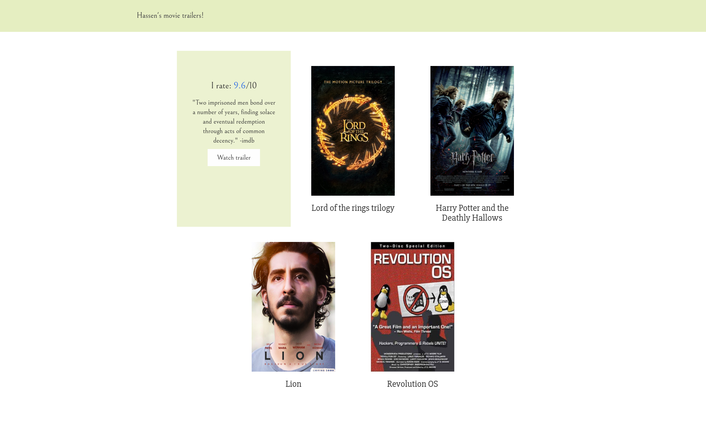

# Hassen's movie trailers!
A personal movie trailers website with minimalist design.

## Project structure

file  | Description
 ---- | -----------
`entertainment_center.py` | Extracts movies from file and generates Movie class instances.
`fresh_tomatoes.py` | Formats the html shunks of the movie website.
`movies.json`| Movies json file.
`static/css/main.css` | Movies page style
`static/css/animate.css` | animations from the [animate.css project](https://daneden.github.io/animate.css/)
`static/css/bootstrap*.css` | Customized bootstrap styles, find `/static/config.json` for details.
`static/js/main.js` | Javascript modal functionality
`static/js/bootstrap*.js` | Customized bootstrap script, find `/static/config.json` for details.
`fresh_tomatoes.html` | Generated html file.

## Usage
`python fresh_tomatoes.py`
